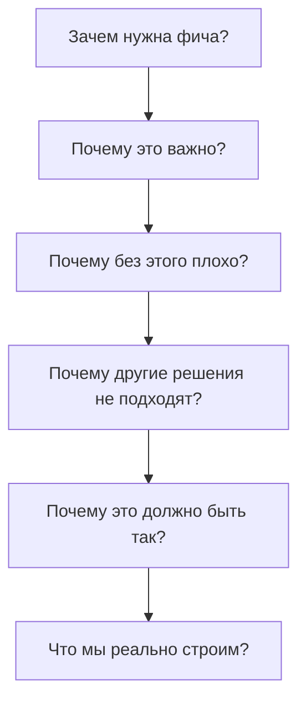

# DDD Discovery — Допрос перед написанием кода

> **🎯 Цель:** Понять бизнес-требования и спроектировать правильную DDD архитектуру до того, как написать хотя бы одну строку кода.

> **📚 Связанные документы:**
> - [DDD Архитектура](../ddd-architecture/SKILL.md) — после discovery, для реализации
> - [DDD Module Template](../ddd-module-template/SKILL.md) — для создания модулей
> - [DDD Code Review](../ddd-code-review/SKILL.md) — для проверки реализации

---

## 🎯 Когда использовать

Используйте этот скилл **перед** началом разработки:
- ✅ Новая фича или модуль
- ✅ Рефакторинг существующего кода
- ✅ Исправление багов (если нужно понять бизнес-логику)
- ✅ Планирование архитектуры
- ✅ Code Review сложных изменений

---

## 📋 Процесс допроса

### 1. **Понимание бизнес-цели** (5 вопросов)

**Задача:** Понять, зачем это нужно бизнесу.

| Вопрос | Ответ | Примечание |
|--------|-------|------------|
| **Какую бизнес-ценность приносит эта фича?** | | |
| **Кто будет использовать?** | | |
| **Какая проблема решается?** | | |
| **Как измерять успех?** | | |
| **Что будет, если не сделать?** | | |

### 2. **Выявление сущностей и агрегатов** (5 вопросов)

**Задача:** Найти главные бизнес-объекты.

| Вопрос | Ответ | Примечание |
|--------|-------|------------|
| **Какие ключевые понятия есть в этой предметной области?** | | |
| **Что является главным (агрегатом)?** | | |
| **Какие сущности принадлежат агрегату?** | | |
| **Как агрегаты связаны между собой?** | | |
| **Есть ли агрегаты, которые можно объединить?** | | |

### 3. **Бизнес-правила и инварианты** (5 вопросов)

**Задача:** Найти правила, которые всегда должны выполняться.

| Вопрос | Ответ | Примечание |
|--------|-------|------------|
| **Какие правила всегда должны соблюдаться?** | | |
| **Что нельзя делать с этими данными?** | | |
| **Какие ограничения есть у сущностей?** | | |
| **Когда состояние считается невалидным?** | | |
| **Какие бизнес-сценарии самые важные?** | | |

### 4. **Жизненный цикл** (5 вопросов)

**Задача:** Понять, как изменяется состояние.

| Вопрос | Ответ | Примечание |
|--------|-------|------------|
| **Как создается объект?** | | |
| **Какие состояния бывают?** | | |
| **Как объект переходит между состояниями?** | | |
| **Что происходит при удалении?** | | |
| **Какие события происходят в процессе?** | | |

### 5. **Границы контекстов** (5 вопросов)

**Задача:** Определить ограниченные контексты.

| Вопрос | Ответ | Примечание |
|--------|-------|------------|
| **С какими другими контекстами взаимодействует?** | | |
| **Какие термины имеют разное значение в разных контекстах?** | | |
| **Где проходят границы контекстов?** | | |
| **Какие данные передаются между контекстами?** | | |
| **Есть ли общие модели между контекстами?** | | |

### 6. **Нефункциональные требования** (5 вопросов)

**Задача:** Понять ограничения производительности и масштабирования.

| Вопрос | Ответ | Примечание |
|--------|-------|------------|
| **Какая ожидаемая нагрузка?** | | |
| **Какие требования к производительности?** | | |
| **Нужна ли консистентность или возможна согласованность?** | | |
| **Какие аудит-требования?** | | |
| **Есть ли требования к безопасности?** | | |

### 7. **Технические ограничения** (5 вопросов)

**Задача:** Понять технические ограничения.

| Вопрос | Ответ | Примечание |
|--------|-------|------------|
| **Есть ли интеграции с внешними системами?** | | |
| **Какие технологии уже используются?** | | |
| **Есть ли ограничения по времени?** | | |
| **Какие риски есть?** | | |
| **Что уже сделано похожее?** | | |

---

## 📝 Шаблон для допроса

```markdown
# DDD Discovery: [Название фичи/модуля]

**Дата:** [Дата]
**Участники:** [Кто участвовал]
**Цель:** [Краткое описание]

---

## 1. Бизнес-цель

**Какую бизнес-ценность приносит эта фича?**
> [Ответ]

**Кто будет использовать?**
> [Ответ]

**Какая проблема решается?**
> [Ответ]

**Как измерять успех?**
> [Ответ]

**Что будет, если не сделать?**
> [Ответ]

---

## 2. Выявленные сущности и агрегаты

### Основной агрегат: **[Название]**

**Корень агрегата:** [Класс]

**Вложенные сущности:**
- [Сущность 1]
- [Сущность 2]
- [Сущность 3]

**Value Objects:**
- [VO 1]
- [VO 2]
- [VO 3]

**Инварианты:**
1. [Инвариант 1]
2. [Инвариант 2]
3. [Инвариант 3]

**Жизненный цикл:**
1. [Создание] → [Состояние 1] → [Состояние 2] → [Завершение]

**События:**
- [Событие 1] — когда происходит [действие]
- [Событие 2] — когда происходит [действие]

---

## 3. Бизнес-правила

### Обязательные правила:
1. [Правило 1]
2. [Правило 2]
3. [Правило 3]

### Сценарии использования:

**Сценарий 1: [Название]**
1. Пользователь делает [действие]
2. Система проверяет [правило]
3. Система выполняет [действие]
4. Результат: [результат]

**Сценарий 2: [Название]**
1. Пользователь делает [действие]
2. Система проверяет [правило]
3. Система выполняет [действие]
4. Результат: [результат]

---

## 4. Границы контекстов

**Контекст:** [Название]

**Ответственность:**
- [Что делает этот контекст]

**Взаимодействие с другими контекстами:**
- [Контекст А] → [что передает/получает]
- [Контекст Б] → [что передает/получает]

**Общий язык (Ubiquitous Language):**
| Термин | Значение |
|--------|----------|
| [Термин 1] | [Значение] |
| [Термин 2] | [Значение] |

---

## 5. Технические решения

### Хранилище данных:
- [ ] PostgreSQL (Prisma)
- [ ] Redis (кэш)
- [ ] Event Store
- [ ] Другое: [укажите]

### Интеграции:
- [ ] [Система 1] → [что делает]
- [ ] [Система 2] → [что делает]

### Производительность:
- Ожидаемая нагрузка: [RPS/запросов]
- Требования к времени ответа: [мс]
- Кэширование: [да/нет, какое]

---

## 6. Архитектурные решения

**Структура модуля:**
```
modules/[module-name]/
├── domain/
│   ├── entities/
│   ├── value-objects/
│   ├── repositories/
│   └── events/
├── application/
│   ├── use-cases/
│   ├── commands/
│   └── dto/
└── infrastructure/
    ├── repositories/
    └── mappers/
```

**Use Cases:**
1. [UseCase 1] — [описание]
2. [UseCase 2] — [описание]
3. [UseCase 3] — [описание]

**Репозитории:**
1. [Репозиторий 1] — для [сущности]
2. [Репозиторий 2] — для [сущности]

**Сервисы:**
1. [Сервис 1] — [что делает]
2. [Сервис 2] — [что делает]

---

## 7. Риски и вопросы

### Риски:
- [ ] [Риск 1] — [вероятность, влияние]
- [ ] [Риск 2] — [вероятность, влияние]

### Открытые вопросы:
- [ ] [Вопрос 1]
- [ ] [Вопрос 2]

### Решения, требующие согласования:
- [ ] [Решение 1]
- [ ] [Решение 2]

---

## 📝 Итоговые выводы

**Ключевые решения:**
1. [Решение 1]
2. [Решение 2]
3. [Решение 3]

**Следующие шаги:**
1. [Шаг 1]
2. [Шаг 2]
3. [Шаг 3]

**Ответственные:**
- [Роль] → [Имя]
- [Роль] → [Имя]
```

---

## 🚀 Практический пример

### Пример допроса для модуля "Заказы"

```markdown
# DDD Discovery: Модуль заказов (Orders)

**Дата:** 2024-01-15
**Участники:** Product Manager, Tech Lead, Developer
**Цель:** Создание системы управления заказами

---

## 1. Бизнес-цель

**Какую бизнес-ценность приносит эта фича?**
Позволяет пользователям оформлять заказы, отслеживать их статус и получать уведомления.

**Кто будет использовать?**
- Покупатели (зарегистрированные пользователи)
- Менеджеры (обработка заказов)
- Администраторы (управление)

**Какая проблема решается?**
- Нет системы заказов
- Пользователи не могут отслеживать статус
- Нет истории заказов

**Как измерять успех?**
- Количество оформленных заказов
- Среднее время обработки
- Удовлетворенность пользователей

**Что будет, если не сделать?**
- Потеря клиентов
- Ручная обработка заказов
- Ошибки в учете

---

## 2. Выявленные сущности и агрегаты

### Основной агрегат: **Order**

**Корень агрегата:** Order

**Вложенные сущности:**
- OrderLine (позиции заказа)
- Payment (платеж)
- Delivery (доставка)

**Value Objects:**
- OrderId (UUID)
- Money (сумма + валюта)
- Address (адрес доставки)
- OrderStatus (статус заказа)

**Инварианты:**
1. Сумма заказа > 0
2. В заказе должна быть хотя бы одна позиция
3. Статус изменяется только по бизнес-правилам
4. Нельзя изменить оплаченный заказ

**Жизненный цикл:**
[Создан] → [Подтвержден] → [Оплачен] → [Отправлен] → [Доставлен] → [Завершен]
                ↓                ↓
            [Отменен]        [Возврат]

**События:**
- OrderPlaced — когда заказ создан
- OrderConfirmed — когда подтвержден
- OrderPaid — когда оплачен
- OrderShipped — когда отправлен
- OrderDelivered — когда доставлен
- OrderCancelled — когда отменен

---

## 3. Бизнес-правила

### Обязательные правила:
1. Корзина не может быть пустой
2. Заказ можно отменить только до оплаты
3. При отмене возвращаются средства
4. Уведомления отправляются при изменении статуса

### Сценарии использования:

**Сценарий 1: Оформление заказа**
1. Пользователь выбирает товары в корзине
2. Система проверяет наличие товаров
3. Пользователь указывает адрес доставки
4. Система создает заказ со статусом "Создан"
5. Система отправляет уведомление

**Сценарий 2: Оплата заказа**
1. Пользователь переходит к оплате
2. Система проверяет статус заказа
3. Пользователь оплачивает
4. Система изменяет статус на "Оплачен"
5. Система отправляет уведомление

---

## 4. Границы контекстов

**Контекст:** Ordering (Заказы)

**Ответственность:**
- Управление заказами
- Отслеживание статусов
- История заказов

**Взаимодействие с другими контекстами:**
- Catalog → получает информацию о товарах
- Inventory → проверяет наличие и резервирует товары
- Payment → обрабатывает оплату
- Delivery → управляет доставкой
- Notification → отправляет уведомления

**Общий язык (Ubiquitous Language):**
| Термин | Значение |
|--------|----------|
| Заказ | Группа товаров, которую покупает пользователь |
| Позиция | Конкретный товар в заказе с количеством |
| Статус | Текущее состояние заказа |
| Доставка | Процесс передачи заказа покупателю |

---

## 5. Технические решения

### Хранилище данных:
- [x] PostgreSQL (Prisma) — основное хранилище
- [x] Redis (кэш) — для кэширования заказов
- [ ] Event Store — для событий

### Интеграции:
- [x] Payment Gateway → обработка платежей
- [x] Delivery Service → расчет и управление доставкой
- [x] Notification Service → уведомления

### Производительность:
- Ожидаемая нагрузка: 1000 заказов/час
- Требования к времени ответа: < 200ms
- Кэширование: да, заказы пользователя

---

## 6. Архитектурные решения

**Структура модуля:**
```
modules/orders/
├── domain/
│   ├── entities/
│   │   ├── Order.ts
│   │   ├── OrderLine.ts
│   │   └── Payment.ts
│   ├── value-objects/
│   │   ├── OrderId.ts
│   │   ├── Money.ts
│   │   ├── Address.ts
│   │   └── OrderStatus.ts
│   ├── repositories/
│   │   ├── IOrderRepository.ts
│   │   └── IOrderLineRepository.ts
│   └── events/
│       ├── OrderPlaced.ts
│       ├── OrderConfirmed.ts
│       └── OrderPaid.ts
├── application/
│   ├── use-cases/
│   │   ├── CreateOrderUseCase.ts
│   │   ├── ConfirmOrderUseCase.ts
│   │   ├── PayOrderUseCase.ts
│   │   └── CancelOrderUseCase.ts
│   ├── commands/
│   │   ├── CreateOrderCommand.ts
│   │   └── CancelOrderCommand.ts
│   └── dto/
│       ├── OrderDto.ts
│       └── CreateOrderDto.ts
└── infrastructure/
    ├── repositories/
    │   └── PrismaOrderRepository.ts
    └── mappers/
        └── OrderMapper.ts
```

**Use Cases:**
1. CreateOrderUseCase — создание заказа из корзины
2. ConfirmOrderUseCase — подтверждение заказа
3. PayOrderUseCase — обработка оплаты
4. CancelOrderUseCase — отмена заказа
5. GetOrderUseCase — получение заказа
6. ListOrdersUseCase — список заказов пользователя

**Репозитории:**
1. OrderRepository — для заказов
2. PaymentRepository — для платежей

**Сервисы:**
1. PaymentService — интеграция с платежной системой
2. DeliveryService — расчет доставки
3. NotificationService — отправка уведомлений

---

## 7. Риски и вопросы

### Риски:
- [x] Интеграция с платежной системой — высокая критичность
- [x] Обработка отмены заказа — сложная логика возврата
- [ ] Консистентность данных между сервисами — возможны рассинхроны

### Открытые вопросы:
- [ ] Как обрабатывать частичные возвраты?
- [ ] Какие статусы нужны для доставки?
- [ ] Нужна ли поддержка нескольких валют?

### Решения, требующие согласования:
- [x] Использовать Event Sourcing или нет?
- [x] Схема взаимодействия с Payment Gateway

---

## 📝 Итоговые выводы

**Ключевые решения:**
1. Использовать агрегат Order как корень
2. Реализовать доменные события для коммуникации
3. Интегрироваться с Payment через доменный сервис
4. Использовать CQRS для разделения команд и запросов

**Следующие шаги:**
1. Создать модуль orders
2. Реализовать доменные сущности
3. Написать use cases
4. Интегрировать с внешними сервисами

**Ответственные:**
- Tech Lead → [Имя]
- Developer → [Имя]
- QA → [Имя]
```

---

## ✅ Чеклист перед началом разработки

Перед тем как начать писать код, убедитесь, что:

- [ ] Заполнили все разделы discovery-документа
- [ ] Согласовали бизнес-цели с продукт-менеджером
- [ ] Выявили все агрегаты и инварианты
- [ ] Определили границы ограниченных контекстов
- [ ] Согласовали API с другими командами
- [ ] Оценили риски и спланировали их mitigation
- [ ] Обсудили архитектурные решения с командой
- [ ] Создали тикеты для всех use cases

---

## 🎯 Итог

### Три главных вопроса перед началом:

1. **Что мы строим?** (Бизнес-цель)
2. **Как это работает?** (Бизнес-правила)
3. **Как это впишется в архитектуру?** (Технические решения)

### Принцип "5 почему":



---

## 🔗 Связанные скиллы

| Скилл | Описание | Когда использовать |
|-------|----------|-------------------|
| [DDD Discovery](../ddd-discovery/SKILL.md) | Текущий скилл | Перед началом разработки |
| [DDD Архитектура](../ddd-architecture/SKILL.md) | Реализация архитектуры | После discovery, при разработке |
| [DDD Module Template](../ddd-module-template/SKILL.md) | Создание модуля | При создании нового модуля |
| [DDD Code Review](../ddd-code-review/SKILL.md) | Проверка кода | При Code Review |
